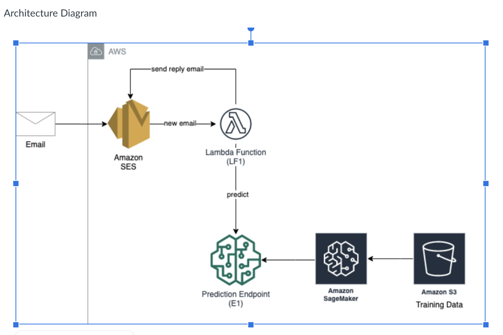

# Spam Mail Detection

## About

A machine learning model to predict whether a message is spam using AWS services.

## Author
Chi Wu, Wanqi Wu

## Services

### SES

Receive email
Put email on S3

### S3

Store emails
Trigger lambda once object is created

### Lambda - LF3

Retrieve the text content
Call prediction endpoint for analysis

### SageMaker

Build machine learning model by notebook
Train the model with massive data
Deploy an endpoint for access

### Cloudformation

Deploy every resource
Input parameter sagemaker endpoint and email address for spam detection service
